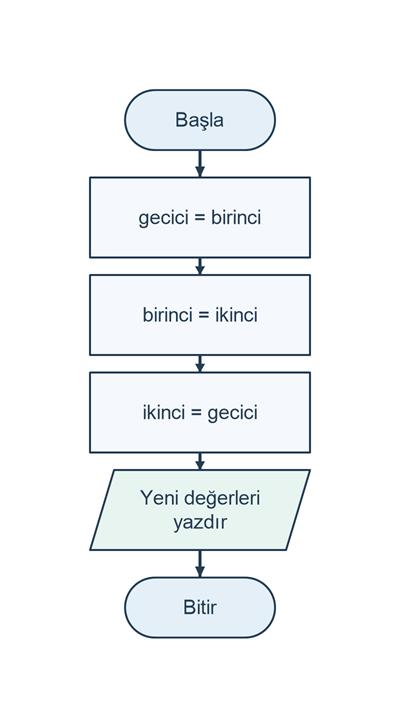

# İki değişkenin değerini takas etme

## Problem tanımı

İki değişkende saklanan tamsayıların yerini değiştirin. Başlangıçta `birinci = 5` ve `ikinci = 9` ise işlem sonunda `birinci = 9`, `ikinci = 5` olmalıdır. Program, değerleri takastan önce ve sonra gösterir.

Bu problem, atama işlemlerinin sırayla yürütüldüğünü öğretir. Bir değişkene yeni değer atanınca eski değeri kaybolur. Eski değeri ikinci değişkene aktarabilmek için geçici bir değişken kullanılır. Her girdi `int` türünün -2147483648 ile 2147483647 aralığında olmalıdır.

## Girdi ve çıktı

| Tür | Ad | Açıklama |
| --- | --- | --- |
| Girdi | `birinci` | Birinci tamsayı |
| Girdi | `ikinci` | İkinci tamsayı |
| Ara değer | `gecici` | Birinci değişkenin eski değeri |
| Çıktı | Önce / sonra | İki değişkenin takas öncesi ve sonrası değerleri |

Girdiler iki ayrı satırda verilir. Sayılar kültürden bağımsız tamsayı biçimiyle okunur ve yazılır; basamak ayırıcı kullanmayın. Sayıya dönüştürülemeyen bir girdi için hata yazılır ve program sona erer.

## Algoritma

1. Birinci tamsayıyı okuyun; geçersizse hata yazıp bitirin.
2. İkinci tamsayıyı okuyun; geçersizse hata yazıp bitirin.
3. İki değişkenin başlangıç değerlerini yazdırın.
4. Birinci değişkenin değerini `gecici` değişkenine kopyalayın.
5. İkinci değişkenin değerini birinci değişkene atayın.
6. Geçici değişkendeki eski birinci değeri ikinci değişkene atayın.
7. İki değişkenin yeni değerlerini yazdırın.

`birinci = ikinci;` ifadesi, sağdaki değeri soldaki değişkene kopyalar. Matematikteki bir eşitlik iddiasından farklı olarak programın durumunu değiştirir.

Şema, geçerli girdiler okunduktan sonraki atama sırasını gösterir.

```diagram
{
  "caption": "Geçici değişkenle takasın işlem sırası",
  "nodes": [
    {"id":"start", "text":"Başla", "kind":"terminal", "x":1, "y":0},
    {"id":"save", "text":"gecici = birinci", "kind":"process", "x":1, "y":0.75},
    {"id":"first", "text":"birinci = ikinci", "kind":"process", "x":1, "y":1.5},
    {"id":"second", "text":"ikinci = gecici", "kind":"process", "x":1, "y":2.25},
    {"id":"print", "text":"Yeni değerleri yazdır", "kind":"io", "x":1, "y":3},
    {"id":"end", "text":"Bitir", "kind":"terminal", "x":1, "y":3.75}
  ],
  "edges": [
    {"from":"start", "to":"save"},
    {"from":"save", "to":"first"},
    {"from":"first", "to":"second"},
    {"from":"second", "to":"print"},
    {"from":"print", "to":"end"}
  ]
}
```



## C# çözümü

```csharp
using System;
using System.Globalization;

Console.Write("Birinci tamsayı: ");
if (!int.TryParse(Console.ReadLine(), NumberStyles.Integer,
    CultureInfo.InvariantCulture, out int birinci))
{
    Console.WriteLine("Hata: Tamsayı giriniz.");
    return;
}

Console.Write("İkinci tamsayı: ");
if (!int.TryParse(Console.ReadLine(), NumberStyles.Integer,
    CultureInfo.InvariantCulture, out int ikinci))
{
    Console.WriteLine("Hata: Tamsayı giriniz.");
    return;
}

Console.WriteLine("Önce: birinci = " + birinci.ToString(CultureInfo.InvariantCulture) +
    ", ikinci = " + ikinci.ToString(CultureInfo.InvariantCulture));

int gecici = birinci;
birinci = ikinci;
ikinci = gecici;

Console.WriteLine("Sonra: birinci = " + birinci.ToString(CultureInfo.InvariantCulture) +
    ", ikinci = " + ikinci.ToString(CultureInfo.InvariantCulture));
```

Kodu bir konsol projesinin `Program.cs` dosyasında çalıştırın. Takas yalnızca değer kopyalar; toplama veya çıkarma yapmaz. Bu nedenle geçerli `int` girdileriyle aritmetik taşma oluşmaz. `gecici`, birinci değerin takas boyunca korunmasını sağlar.

## Örnek çalıştırmalar

Tablo giriş istemlerini içermez; sonuç satırları sırayla gösterilir.

| Girdi (ayrı satırlarda) | Sonuç satırları |
| --- | --- |
| `5`, `9` | `Önce: birinci = 5, ikinci = 9`<br>`Sonra: birinci = 9, ikinci = 5` |
| `-3`, `0` | `Önce: birinci = -3, ikinci = 0`<br>`Sonra: birinci = 0, ikinci = -3` |
| `7`, `7` | `Önce: birinci = 7, ikinci = 7`<br>`Sonra: birinci = 7, ikinci = 7` |
| `abc` | `Hata: Tamsayı giriniz.` |

## Sınır durumları

- İki değer aynıysa ekrandaki değerler değişmez; algoritma yine geçerlidir.
- Negatif değerler, sıfır ve `int` sınırları takas edilebilir.
- Aralık dışı sayı, ondalıklı sayı veya boş satır reddedilir.
- Geçici değer alınmadan `birinci = ikinci; ikinci = birinci;` yazılırsa iki değişken de eski ikinci değeri taşır.

## Kazanımlar

- Atama işleminin yönünü ve etkisini açıklamak.
- İşlem sırasının programın sonucunu belirlediğini görmek.
- Kaybolacak bir değeri geçici değişkende korumak.
- Programı adım adım izleyerek değişken değerlerini takip etmek.

## Alıştırmalar

1. Girdiler `4` ve `11` iken her atamadan sonra üç değişkenin değerini bir tabloya yazın.
2. Takas bloğunu art arda iki kez çalıştırın; sonucu açıklayın.
3. Üç değişkenin değerlerini döndürün: eski birinci ikinciye, eski ikinci üçüncüye, eski üçüncü birinciye geçsin.
