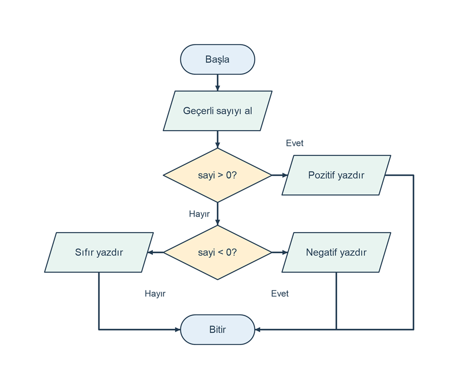

# Sayının pozitif negatif veya sıfır olduğunu belirleme

## Problem tanımı

Kullanıcının girdiği tamsayının pozitif, negatif veya sıfır olduğunu belirleyin. Sıfırdan büyük sayılar pozitif, sıfırdan küçük sayılar negatif olarak sınıflandırılır. Sıfır için ayrı bir sonuç yazdırılır.

Önceki örneklerde doğrulama amacıyla görülen koşullar, burada problemin asıl çözümünü oluşturur. Geçerli bir tamsayı için üç durumdan yalnızca biri gerçekleşir. Girdi, `int` türünün -2147483648 ile 2147483647 aralığında olmalıdır.

## Girdi ve çıktı

| Tür | Ad | Açıklama |
| --- | --- | --- |
| Girdi | `sayi` | İşareti belirlenecek tamsayı |
| Çıktı | Sınıflandırma | `Sonuç: Pozitif`, `Sonuç: Negatif` veya `Sonuç: Sıfır` |

Sayı kültürden bağımsız tamsayı biçimiyle okunur; basamak ayırıcı kullanmayın. Geçersiz girdi için `Hata: Tamsayı giriniz.` yazdırılır. Böyle bir durumda sayı sınıflandırılmaz; program sona erer.

## Algoritma

1. Tamsayıyı isteyin ve okuyun.
2. Girdi geçerli bir `int` değilse hata yazıp bitirin.
3. Sayı sıfırdan büyükse `Sonuç: Pozitif` yazdırın.
4. Değilse, sayı sıfırdan küçükse `Sonuç: Negatif` yazdırın.
5. Bu koşulların ikisi de sağlanmıyorsa `Sonuç: Sıfır` yazdırın.
6. Programı bitirin.

Bir tamsayı ne sıfırdan büyük ne de sıfırdan küçükse sıfırdır. Bu nedenle son dalda ayrıca `sayi == 0` karşılaştırması yapmaya gerek yoktur.

Şema, geçerli bir tamsayı için birbirini dışlayan üç sonucu gösterir.

```diagram
{
  "caption": "Sayının işaretine göre karar verme",
  "nodes": [
    {"id":"start", "text":"Başla", "kind":"terminal", "x":1, "y":0},
    {"id":"read", "text":"Geçerli sayıyı al", "kind":"io", "x":1, "y":0.8},
    {"id":"positive", "text":"sayi > 0?", "kind":"decision", "x":1, "y":1.8},
    {"id":"pout", "text":"Pozitif yazdır", "kind":"io", "x":2, "y":1.8},
    {"id":"negative", "text":"sayi < 0?", "kind":"decision", "x":1, "y":3},
    {"id":"nout", "text":"Negatif yazdır", "kind":"io", "x":2, "y":3},
    {"id":"zout", "text":"Sıfır yazdır", "kind":"io", "x":0, "y":3},
    {"id":"end", "text":"Bitir", "kind":"terminal", "x":1, "y":4.2}
  ],
  "edges": [
    {"from":"start", "to":"read"},
    {"from":"read", "to":"positive"},
    {"from":"positive", "to":"pout", "label":"Evet", "label_at":[1.65,1.3]},
    {"from":"positive", "to":"negative", "label":"Hayır"},
    {"from":"negative", "to":"nout", "label":"Evet"},
    {"from":"negative", "to":"zout", "label":"Hayır"},
    {"from":"pout", "to":"end", "via":[[2.65,1.8],[2.65,4.2]]},
    {"from":"nout", "to":"end", "via":[[2,4.2]]},
    {"from":"zout", "to":"end", "via":[[0,4.2]]}
  ]
}
```



## C# çözümü

```csharp
using System;
using System.Globalization;

Console.Write("Tamsayı: ");
if (!int.TryParse(Console.ReadLine(), NumberStyles.Integer,
    CultureInfo.InvariantCulture, out int sayi))
{
    Console.WriteLine("Hata: Tamsayı giriniz.");
    return;
}

if (sayi > 0)
{
    Console.WriteLine("Sonuç: Pozitif");
}
else if (sayi < 0)
{
    Console.WriteLine("Sonuç: Negatif");
}
else
{
    Console.WriteLine("Sonuç: Sıfır");
}
```

Kod, bir konsol projesinin `Program.cs` dosyasına tek başına konabilir. `>` ve `<` işleçleri karşılaştırma yapar. Sonuçları doğru veya yanlış değeridir. `if / else if / else` zinciri, ilk doğru koşulun dalını çalıştırır; sonraki dalları atlar. Böylece geçerli girdi için yalnızca bir sonuç satırı yazılır.

## Örnek çalıştırmalar

Tablo, giriş isteminden sonra yazılan sonuç satırını gösterir.

| Girdi | Sonuç satırı |
| --- | --- |
| `8` | `Sonuç: Pozitif` |
| `-8` | `Sonuç: Negatif` |
| `0` | `Sonuç: Sıfır` |
| `2147483647` | `Sonuç: Pozitif` |
| `-2147483648` | `Sonuç: Negatif` |
| `2.5` | `Hata: Tamsayı giriniz.` |

## Sınır durumları

- Sıfır, pozitif veya negatif kategorisine eklenmez; ayrı dalda işlenir.
- `-0` tamsayı olarak sıfırdır ve `Sonuç: Sıfır` üretir.
- `int` alt ve üst sınırları doğrudan karşılaştırılabilir; aritmetik işlem yapılmadığı için taşma oluşmaz.
- Boş satır, metin, ondalıklı sayı ve aralık dışı tamsayı reddedilir.
- İlk koşul `sayi >= 0` olsaydı sıfır yanlışlıkla pozitif olarak sınıflandırılırdı.

## Kazanımlar

- Karşılaştırma işleçleriyle koşul oluşturmak.
- Birbirini dışlayan durumları tek bir koşul zincirinde düzenlemek.
- Sınırdaki değeri ayrıca test etmek.
- Girdi doğrulama ile problemin karar adımını birbirinden ayırt etmek.

## Alıştırmalar

1. Negatif koşulu önce denetleyecek biçimde dalları yeniden düzenleyin.
2. Pozitif sayılarda `Sıfırdan büyük.`, negatif sayılarda `Sıfırdan küçük.` açıklamalarını da yazdırın.
3. Test kümesine neden hem `0` hem de `1` ve `-1` eklenmesi gerektiğini açıklayın.
