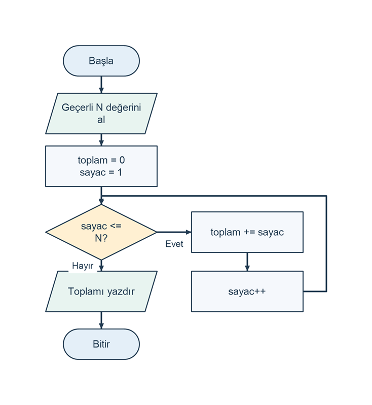

# 1 ile N arasındaki sayıların toplamı

## Problem tanımı

Kullanıcıdan sıfır veya pozitif bir `N` tamsayısı alın. `1` ile `N` arasındaki bütün tamsayıları, iki uç dahil olacak şekilde toplayın. Bu çalışmada amaç, toplamı hazır bir formülle bulmak yerine sayıları bir döngü içinde tek tek işlemektir.

Örneğin `N = 4` için sonuç `1 + 2 + 3 + 4 = 10` olur. `N = 0` için toplanacak sayı yoktur ve sonuç sıfırdır. Biriktirici değişken, döngü boyunca işlenmiş sayıların toplamını saklar; sayaç ise sıradaki sayıyı temsil eder.

## Girdi ve çıktı

| Tür | Ad | Açıklama |
| --- | --- | --- |
| Girdi | `n` | 0 ile 1000000 arasında bir tamsayı. |
| Çıktı | `toplam` | 1'den `n` değerine kadar tamsayıların toplamı; `long` türünde. |

Program `N (0..1000000): ` istemini gösterir. Tek bir tamsayı yazıp Enter tuşuna basın. Basamak ayırıcı kullanmayın. Bu üst sınır, döngünün başlangıç düzeyi bir uygulamada makul sürede tamamlanmasını sağlar. Sonuçlar kültürden bağımsız biçimde yazdırılır.

## Algoritma

1. `N` değerini okuyun.
2. Girdinin tamsayı olduğunu ve 0 ile 1000000 aralığında bulunduğunu doğrulayın.
3. Geçersiz girişte hata mesajı gösterip programı bitirin.
4. `toplam` değişkenini sıfırla başlatın.
5. Sayacı 1'den başlatın; sayaç `N` değerini aşmadığı sürece döngüyü sürdürün.
6. Her adımda sayaç değerini toplama ekleyip sayacı bir artırın.
7. Döngü bitince toplamı yazdırın.

Sayaç 1 iken toplam 1, sayaç 2 işlendiğinde toplam 3 olur. Her adımda önceki sonuç yeni sayıyla genişletilir. Döngü koşulundaki `<=`, `N` değerinin de toplama katılmasını sağlar.

Şema, doğrulanmış `N` girdisi için döngünün koşul, gövde ve artış adımlarını gösterir. `N = 0` durumunda ilk koşul yanlış olur.

```diagram
{
  "caption": "Sayaç ve biriktirici ile toplam döngüsü",
  "nodes": [
    {"id":"start", "text":"Başla", "kind":"terminal", "x":1, "y":0},
    {"id":"read", "text":"Geçerli N değerini al", "kind":"io", "x":1, "y":0.8},
    {"id":"init", "text":"toplam = 0\nsayac = 1", "kind":"process", "x":1, "y":1.6},
    {"id":"check", "text":"sayac <= N?", "kind":"decision", "x":1, "y":2.6},
    {"id":"body", "text":"toplam += sayac", "kind":"process", "x":2.2, "y":2.6},
    {"id":"next", "text":"sayac++", "kind":"process", "x":2.2, "y":3.5},
    {"id":"out", "text":"Toplamı yazdır", "kind":"io", "x":1, "y":3.5},
    {"id":"end", "text":"Bitir", "kind":"terminal", "x":1, "y":4.3}
  ],
  "edges": [
    {"from":"start", "to":"read"},
    {"from":"read", "to":"init"},
    {"from":"init", "to":"check"},
    {"from":"check", "to":"body", "label":"Evet"},
    {"from":"body", "to":"next"},
    {"from":"next", "to":"check", "via":[[2.85,3.5],[2.85,2.05],[1,2.05]]},
    {"from":"check", "to":"out", "label":"Hayır"},
    {"from":"out", "to":"end"}
  ]
}
```



## C# çözümü

```csharp
using System;
using System.Globalization;

Console.Write("N (0..1000000): ");
if (!int.TryParse(Console.ReadLine(), NumberStyles.Integer,
    CultureInfo.InvariantCulture, out int n) || n < 0 || n > 1000000)
{
    Console.WriteLine("Hata: 0 ile 1000000 arasında bir tamsayı girin.");
    return;
}

long toplam = 0;
for (int sayac = 1; sayac <= n; sayac++)
{
    toplam += sayac;
}

Console.WriteLine("Toplam: " +
    toplam.ToString(CultureInfo.InvariantCulture));
```

`toplam += sayac`, `toplam = toplam + sayac` ifadesinin kısa yazımıdır. Toplamın `long` olması, izin verilen büyük girdilerde sonucun `int` sınırını aşmasına olanak tanır. Sayaç ise verilen üst sınır nedeniyle `int` türünde tutulabilir.

## Örnek çalıştırmalar

Tabloda istem metni gösterilmez.

| Girdi | Sonuç |
| --- | --- |
| `0` | `Toplam: 0` |
| `1` | `Toplam: 1` |
| `4` | `Toplam: 10` |
| `10` | `Toplam: 55` |
| `1000000` | `Toplam: 500000500000` |

## Sınır durumları

- `N = 0` olduğunda döngü gövdesi hiç çalışmaz; başlangıç toplamı korunur.
- `N = 1` olduğunda döngü tam bir kez çalışır.
- Negatif sayı, `1000001`, boş giriş ve ondalık sayı reddedilir.
- En büyük izin verilen toplam `500000500000`, `long` aralığına sığar.

## Kazanımlar

- Tekrarlı işlemleri `for` döngüsüyle ifade etme.
- Sayaç ve biriktirici değişkenlerinin görevlerini ayırma.
- Döngünün başlangıç, koşul ve artış bölümlerini açıklama.
- Girdi sınırına göre sonuç türünü seçme.

## Alıştırmalar

1. Yalnızca 1 ile `N` arasındaki çift sayıları toplayın.
2. Döngüyü `while` kullanarak yeniden yazın.
3. `N = 5` için her adımın sayaç ve toplam değerlerini bir tabloda gösterin.
