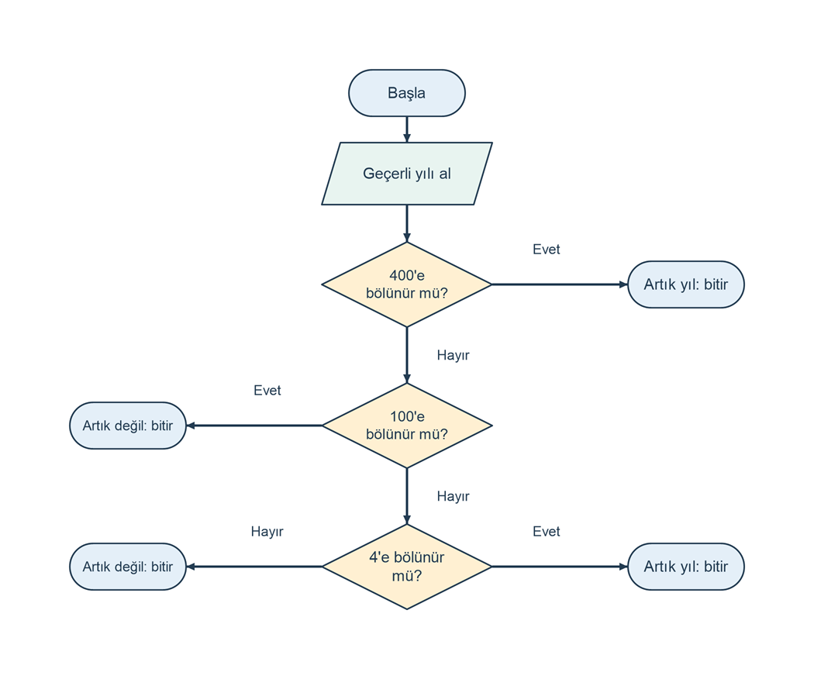

# Artık yılı belirleme

## Problem tanımı

Kullanıcının girdiği yılın artık yıl olup olmadığını belirleyin. Bu alıştırmada Gregoryen takviminin artık yıl hesabı kullanılır: 400'e tam bölünen yıl artık yıldır. 400'e bölünmeyen ama 100'e tam bölünen yıl artık yıl değildir. Diğer yıllarda 4'e tam bölünenler artık yıldır.

Bu hesap modeli 1 ile 9999 arasındaki bütün girdilere uygulanır. Geçmişte farklı toplumların takvim kullanım tarihleri veya takvim geçişleri araştırılmaz. Artık yılda Şubat 29 gün, diğer yıllarda 28 gün olarak kabul edilir.

Örneğin 1900, 4'e bölünmesine rağmen 100'e bölünüp 400'e bölünmediği için artık yıl değildir. 2000 ise 400'e bölündüğü için artık yıldır. Yalnızca 4'e bölünme kontrolü bu iki durumu ayıramaz.

## Girdi ve çıktı

| Tür | Ad | Açıklama |
| --- | --- | --- |
| Girdi | `yil` | 1 ile 9999 arasında tamsayı yıl. |
| Çıktı | Karar | `Sonuç: Artık yıl` veya `Sonuç: Artık yıl değil`. |

`Yıl (1..9999): ` istemine bir tamsayı yazın. Basamak ayırıcı veya ondalık bölüm kullanmayın. Geçersiz girişte `Hata: Yıl 1 ile 9999 arasında bir tamsayı olmalıdır.` yazılır ve program sona erer.

## Algoritma

1. Yılı okuyun; 1 ile 9999 arasında tamsayı değilse hata yazıp bitirin.
2. Yıl 400'e tam bölünüyorsa artık yıl sonucunu seçin.
3. Değilse, yıl 100'e tam bölünüyorsa artık yıl değil sonucunu seçin.
4. Değilse, yıl 4'e tam bölünüyorsa artık yıl sonucunu seçin.
5. Bu koşullar sağlanmıyorsa artık yıl değil sonucunu seçin.
6. Sonucu yazdırıp bitirin.

`%` bölme işleminden kalanı verir. `yil % 4 == 0`, yılın 4'e tam bölündüğünü belirtir. Kural tek bir koşul olarak `yil % 400 == 0 || (yil % 4 == 0 && yil % 100 != 0)` biçiminde de yazılabilir. İlk parça 400 kuralını, parantezli parça ise 100 istisnası dışındaki 4 kuralını ifade eder.

Şema doğrulanmış girdi üzerinde kararların sırasını gösterir. Sonuç yazılan uçlar programın bitişini de temsil eder.

```diagram
{
  "caption": "Artık yıl kuralının sıralı bölünebilme kontrolleri",
  "nodes": [
    {"id":"start", "text":"Başla", "kind":"terminal", "x":1, "y":0},
    {"id":"read", "text":"Geçerli yılı al", "kind":"io", "x":1, "y":0.8},
    {"id":"d400", "text":"400'e bölünür mü?", "kind":"decision", "x":1, "y":1.9},
    {"id":"yes400", "text":"Artık yıl: bitir", "kind":"terminal", "x":2.5, "y":1.9},
    {"id":"d100", "text":"100'e bölünür mü?", "kind":"decision", "x":1, "y":3.3},
    {"id":"no100", "text":"Artık değil: bitir", "kind":"terminal", "x":-0.5, "y":3.3},
    {"id":"d4", "text":"4'e bölünür mü?", "kind":"decision", "x":1, "y":4.7},
    {"id":"yes4", "text":"Artık yıl: bitir", "kind":"terminal", "x":2.5, "y":4.7},
    {"id":"no4", "text":"Artık değil: bitir", "kind":"terminal", "x":-0.5, "y":4.7}
  ],
  "edges": [
    {"from":"start", "to":"read"},
    {"from":"read", "to":"d400"},
    {"from":"d400", "to":"yes400", "label":"Evet", "label_at":[1.75,1.55]},
    {"from":"d400", "to":"d100", "label":"Hayır", "label_at":[1.25,2.6]},
    {"from":"d100", "to":"no100", "label":"Evet", "label_at":[0.25,2.95]},
    {"from":"d100", "to":"d4", "label":"Hayır", "label_at":[1.25,4]},
    {"from":"d4", "to":"yes4", "label":"Evet", "label_at":[1.75,4.35]},
    {"from":"d4", "to":"no4", "label":"Hayır", "label_at":[0.25,4.35]}
  ]
}
```



## C# çözümü

```csharp
using System;
using System.Globalization;

Console.Write("Yıl (1..9999): ");
if (!int.TryParse(Console.ReadLine(), NumberStyles.Integer,
    CultureInfo.InvariantCulture, out int yil) || yil < 1 || yil > 9999)
{
    Console.WriteLine("Hata: Yıl 1 ile 9999 arasında bir tamsayı olmalıdır.");
    return;
}

bool artikYil = yil % 400 == 0 || (yil % 4 == 0 && yil % 100 != 0);
if (artikYil)
{
    Console.WriteLine("Sonuç: Artık yıl");
}
else
{
    Console.WriteLine("Sonuç: Artık yıl değil");
}
```

Kod, bir konsol projesinin `Program.cs` dosyasına tek başına konabilir. Şemadaki sıralı kararlar kodda tek bir `bool` ifadesinde birleştirilmiştir; iki anlatım aynı sonucu üretir. `!= 0`, tam bölünmeme durumunu ifade eder. `DateTime` gibi takvim hesabını hazır yapan bir bileşen kullanılmadan kuralın kendisi uygulanır.

## Örnek çalıştırmalar

Tablo, giriş isteminden sonra yazılan tam satırı gösterir.

| Yıl | Sonuç satırı | Gerekçe |
| --- | --- | --- |
| `2024` | `Sonuç: Artık yıl` | 4'e bölünür, 100'e bölünmez. |
| `2023` | `Sonuç: Artık yıl değil` | 4'e bölünmez. |
| `1900` | `Sonuç: Artık yıl değil` | 100'e bölünür, 400'e bölünmez. |
| `2000` | `Sonuç: Artık yıl` | 400'e bölünür. |
| `2100` | `Sonuç: Artık yıl değil` | 100'e bölünür, 400'e bölünmez. |
| `1` | `Sonuç: Artık yıl değil` | Geçerli en küçük yıl. |
| `4` | `Sonuç: Artık yıl` | Hesap modeli bu girdiye de uygulanır. |
| `9999` | `Sonuç: Artık yıl değil` | Geçerli en büyük yıl. |
| `0` | `Hata: Yıl 1 ile 9999 arasında bir tamsayı olmalıdır.` | Alt sınırın dışında. |
| `10000` | `Hata: Yıl 1 ile 9999 arasında bir tamsayı olmalıdır.` | Üst sınırın dışında. |
| `2024.5` | `Hata: Yıl 1 ile 9999 arasında bir tamsayı olmalıdır.` | Tamsayı değil. |

## Sınır durumları

- Sıfır veya negatif yıl kabul edilmez; hesap modeli 1 ile 9999 arasındaki pozitif yıllarla sınırlıdır.
- 100'e bölünen yıllarda 4 koşulu tek başına yeterli değildir; 400 istisnası ayrıca uygulanır.
- 400'e bölünen her yıl 100'e ve 4'e de bölünür. Bu nedenle şemada 400 kontrolü önce yapılır.
- 9996 kabul edilen aralıktaki son artık yıldır; 9999 geçerli ama artık olmayan bir yıldır.
- Boş giriş, sayı olmayan metin ve ondalıklı sayı için karar üretilmez.
- Bölme bölenleri sabit ve sıfırdan farklı olduğundan sıfıra bölme oluşmaz.

## Kazanımlar

- Tam bölünmeyi `%` işleci ve sıfır karşılaştırmasıyla denetleme.
- Genel bir kuralın istisnasını ve istisnanın istisnasını mantıksal koşullara dönüştürme.
- Sıralı karar şeması ile birleşik `bool` ifadesinin eşdeğerliğini örneklerle gösterme.
- 1900 ve 2000 gibi kuralları birbirinden ayıran test girdileri seçme.

## Alıştırmalar

1. Birleşik koşulu şemadaki sıraya uygun `if / else if / else` zinciriyle yeniden yazın.
2. Karara ek olarak Şubat ayındaki gün sayısını 28 veya 29 olarak yazdırın.
3. Yalnızca `yil % 4 == 0` kullanan sürümün 1900, 2000, 2024 ve 2100 girdilerinde hangi sonuçları yanlış ürettiğini belirleyin.
