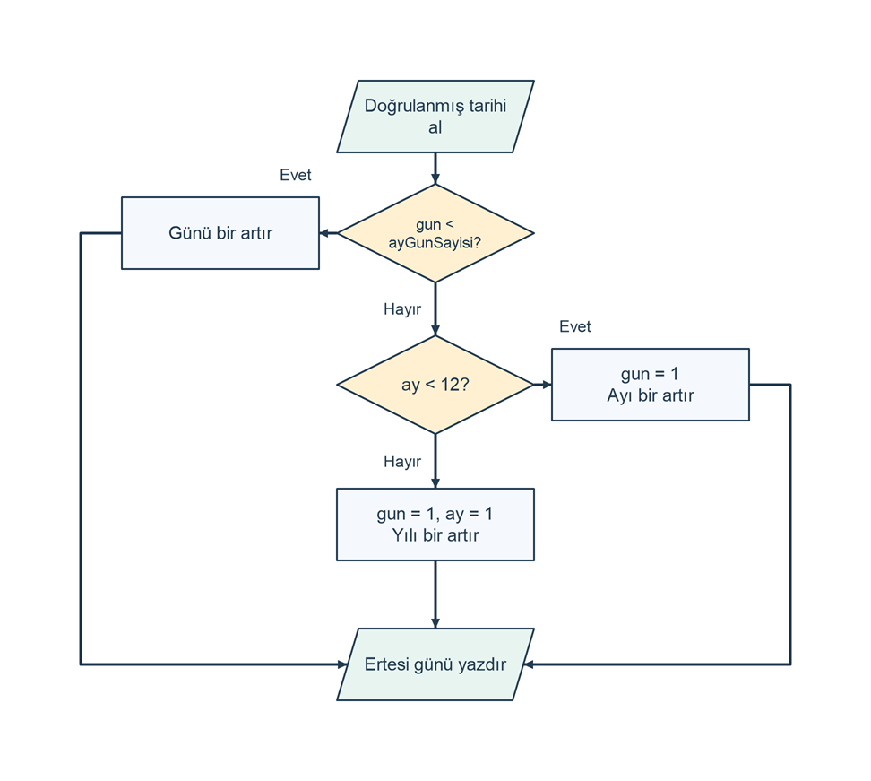

# Bir tarihin ertesi gününü bulma

## Problem tanımı

Yıl, ay ve gün olarak girilen geçerli bir tarihin ertesi gününü hesaplayın. Ayın ortasında yalnızca gün artar; ayın son gününde gün 1'e döner ve ay artar; aralık sonundaysa gün ve ay 1'e döner, yıl artar. Şubatın son gününü belirlerken artık yıl kuralını kullanın.

Gregoryen takvimin hesap kuralları 1 ile 9999 arasındaki bütün yıllara uygulanır. 1582 öncesi yıllar için de aynı model kullanılır; tarihsel takvim geçişleri ele alınmaz. Artık yıl, 400'e bölünen ya da 4'e bölünüp 100'e bölünmeyen yıldır. `DateTime` gibi hazır tarih araçları kullanmadan kuralları koşullar ve tamsayı işlemleriyle uygulayın.

Hem girdi hem çıktı 1 ile 9999 arasındaki yılları kullanmalıdır. Bu nedenle `9999-12-31` geçerli bir tarih olsa da ertesi günü bu çalışmanın çıktı aralığına sığmaz; program açık bir aralık mesajı verir.

## Girdi ve çıktı

| Tür | Ad | Açıklama |
| --- | --- | --- |
| Girdi | `yil` | 1 ile 9999 arasında `int`. |
| Girdi | `ay` | 1 ile 12 arasında `int`. |
| Girdi | `gun` | Önce 1 ile 31 arasında kontrol edilen, sonra ilgili ayın gün sayısıyla doğrulanan `int`. |
| Çıktı | Ertesi gün | `Ertesi gün: YYYY-MM-DD` biçiminde dört basamaklı yıl, iki basamaklı ay ve gün. |

`Yıl (1..9999): `, `Ay (1..12): ` ve `Gün (1..31): ` istemlerine sırasıyla ayrı satırlarda tamsayı girin. Alan biçimi veya aralığı yanlışsa ilgili hata satırı yazılır. Ayda bulunmayan bir gün için `Hata: Girilen ayda bu gün yoktur.`; üst çıktı sınırı için `Hata: Ertesi gün 1..9999 yıl aralığının dışındadır.` yazılır. Bu durumlarda tarih çıktısı verilmez.

## Algoritma

1. Yılı, ayı ve günü sırayla okuyun; temel aralıklarını doğrulayın.
2. Artık yıl durumunu hesaplayın.
3. Ayı `switch` ile seçerek 31, 30 veya şubat için 28/29 değerini `ayGunSayisi` değişkenine atayın.
4. Gün bu ayın gün sayısından büyükse geçersiz tarih mesajı yazıp bitirin.
5. Tarih `9999-12-31` ise ertesi gün çıktı aralığının dışına çıkacağı için hata yazıp bitirin.
6. Gün ayın son gününden küçükse yalnızca günü bir artırın.
7. Ayın son günündeyseniz ve ay 12'den küçükse günü 1 yapıp ayı bir artırın.
8. Ayın son günündeyseniz ve ay 12 ise günü ve ayı 1 yapıp yılı bir artırın.
9. Güncellenmiş tarihi dört ve iki basamaklı alanlarla yazdırın.

Bir tarihin alanlarını ayrı ayrı doğrulamak yeterli değildir: `2025`, `2`, `31` değerlerinin her biri temel aralığındadır, ancak bir arada geçerli bir tarih oluşturmaz. Önce ilgili ayın uzunluğu bulunmalı, sonra gün bu uzunlukla karşılaştırılmalıdır.

Şema, girdi doğrulaması ve üst sınır kontrolü tamamlandıktan sonraki üç güncelleme yolunu gösterir.

```diagram
{
  "caption": "Geçerli bir tarihte gün, ay ve yıl taşması",
  "nodes": [
    {"id":"read", "text":"Doğrulanmış tarihi al", "kind":"io", "x":1, "y":0},
    {"id":"day", "text":"gun < ayGunSayisi?", "kind":"decision", "x":1, "y":1},
    {"id":"normal", "text":"Günü bir artır", "kind":"process", "x":0, "y":1},
    {"id":"month", "text":"ay < 12?", "kind":"decision", "x":1, "y":2.3},
    {"id":"nextmonth", "text":"gun = 1\nAyı bir artır", "kind":"process", "x":2, "y":2.3},
    {"id":"nextyear", "text":"gun = 1, ay = 1\nYılı bir artır", "kind":"process", "x":1, "y":3.5},
    {"id":"write", "text":"Ertesi günü yazdır", "kind":"io", "x":1, "y":4.7}
  ],
  "edges": [
    {"from":"read", "to":"day"},
    {"from":"day", "to":"normal", "label":"Evet", "label_at":[0.35,0.5]},
    {"from":"day", "to":"month", "label":"Hayır"},
    {"from":"month", "to":"nextmonth", "label":"Evet", "label_at":[1.65,1.8]},
    {"from":"month", "to":"nextyear", "label":"Hayır"},
    {"from":"normal", "to":"write", "via":[[-0.65,1],[-0.65,4.7]]},
    {"from":"nextmonth", "to":"write", "via":[[2.65,2.3],[2.65,4.7]]},
    {"from":"nextyear", "to":"write"}
  ]
}
```



## C# çözümü

```csharp
using System;
using System.Globalization;

Console.Write("Yıl (1..9999): ");
if (!int.TryParse(Console.ReadLine(), NumberStyles.Integer,
    CultureInfo.InvariantCulture, out int yil) || yil < 1 || yil > 9999)
{
    Console.WriteLine("Hata: Yıl 1 ile 9999 arasında bir tamsayı olmalıdır.");
    return;
}

Console.Write("Ay (1..12): ");
if (!int.TryParse(Console.ReadLine(), NumberStyles.Integer,
    CultureInfo.InvariantCulture, out int ay) || ay < 1 || ay > 12)
{
    Console.WriteLine("Hata: Ay 1 ile 12 arasında bir tamsayı olmalıdır.");
    return;
}

Console.Write("Gün (1..31): ");
if (!int.TryParse(Console.ReadLine(), NumberStyles.Integer,
    CultureInfo.InvariantCulture, out int gun) || gun < 1 || gun > 31)
{
    Console.WriteLine("Hata: Gün 1 ile 31 arasında bir tamsayı olmalıdır.");
    return;
}

bool artikYil = yil % 400 == 0 || (yil % 4 == 0 && yil % 100 != 0);
int ayGunSayisi;
switch (ay)
{
    case 1:
    case 3:
    case 5:
    case 7:
    case 8:
    case 10:
    case 12:
        ayGunSayisi = 31;
        break;
    case 4:
    case 6:
    case 9:
    case 11:
        ayGunSayisi = 30;
        break;
    case 2:
        if (artikYil)
        {
            ayGunSayisi = 29;
        }
        else
        {
            ayGunSayisi = 28;
        }
        break;
    default:
        Console.WriteLine("Hata: Ay 1 ile 12 arasında bir tamsayı olmalıdır.");
        return;
}

if (gun > ayGunSayisi)
{
    Console.WriteLine("Hata: Girilen ayda bu gün yoktur.");
    return;
}
if (yil == 9999 && ay == 12 && gun == 31)
{
    Console.WriteLine("Hata: Ertesi gün 1..9999 yıl aralığının dışındadır.");
    return;
}

if (gun < ayGunSayisi)
{
    gun++;
}
else if (ay < 12)
{
    gun = 1;
    ay++;
}
else
{
    gun = 1;
    ay = 1;
    yil++;
}

Console.WriteLine("Ertesi gün: " + yil.ToString("D4", CultureInfo.InvariantCulture) + "-" +
    ay.ToString("D2", CultureInfo.InvariantCulture) + "-" +
    gun.ToString("D2", CultureInfo.InvariantCulture));
```

`gun++`, `ay++` ve `yil++` ilgili tamsayıyı bir artırır. Koşul zinciri güncelleme yollarından yalnızca birini çalıştırır. Bir ayın son gününden sonra önce günün 1'e dönmesi gerekir; yalnızca `gun++` kullanmak 32. gün gibi geçersiz bir sonuç üretebilir. Tarih araçlarına başvurmadan tüm kurallar görünür biçimde uygulanır.

## Örnek çalıştırmalar

Girdiler yıl, ay ve gün sırasındadır; sonuç sütunu giriş istemlerinden sonraki satırı gösterir.

| Girdi | Sonuç | Açıklama |
| --- | --- | --- |
| `2025`, `3`, `14` | `Ertesi gün: 2025-03-15` | Ayın içinde normal gün artışı. |
| `2025`, `4`, `30` | `Ertesi gün: 2025-05-01` | 30 günlük ayın sonu. |
| `2025`, `1`, `31` | `Ertesi gün: 2025-02-01` | 31 günlük ayın sonu. |
| `2024`, `2`, `28` | `Ertesi gün: 2024-02-29` | Artık yılda şubatın içinde kalınır. |
| `2024`, `2`, `29` | `Ertesi gün: 2024-03-01` | Artık yılın şubat sonu. |
| `1900`, `2`, `28` | `Ertesi gün: 1900-03-01` | 1900 normal yıldır. |
| `2000`, `2`, `28` | `Ertesi gün: 2000-02-29` | 2000 artık yıldır. |
| `2025`, `12`, `31` | `Ertesi gün: 2026-01-01` | Yıl değişir. |
| `1`, `1`, `1` | `Ertesi gün: 0001-01-02` | En küçük tarih, dört basamaklı yıl. |
| `9999`, `12`, `30` | `Ertesi gün: 9999-12-31` | En büyük üretilebilir sonuç. |
| `9999`, `12`, `31` | `Hata: Ertesi gün 1..9999 yıl aralığının dışındadır.` | Girdi geçerli, çıktı aralık dışıdır. |
| `2025`, `2`, `29` | `Hata: Girilen ayda bu gün yoktur.` | Normal yılda 29 şubat yoktur. |
| `2025`, `4`, `31` | `Hata: Girilen ayda bu gün yoktur.` | Nisanın 31. günü yoktur. |
| `2025`, `1`, `0` | `Hata: Gün 1 ile 31 arasında bir tamsayı olmalıdır.` | Temel gün aralığı geçersizdir. |
| İlk girdi `yıl` | `Hata: Yıl 1 ile 9999 arasında bir tamsayı olmalıdır.` | Metin girişi reddedilir. |

## Sınır durumları

- 28, 29, 30 ve 31 günlük ayların sonları farklı olsa da aynı güncelleme koşulları kullanılabilir.
- Gün, ay uzunluğuyla karşılaştırılmadan tarih geçerli kabul edilmez.
- 1900 ve 2000 yılları, şubatın sonunu belirleyen yüzyıl istisnalarını sınar.
- Ayın son gününde `ay < 12` doğruysa yıl değişmez; aralık sonunda yıl da artar.
- `9999-12-31` için aralık kontrolü yıl artırılmadan önce yapılır; 10000 yılı yazdırılmaz.
- Her geçersiz girişte veya aralık dışı sonuçta tek hata satırı yazılır ve tarih çıktısı verilmez.

## Kazanımlar

- Birden çok alanın tek bir geçerli durum oluşturduğunu birlikte doğrulama.
- Önce ay uzunluğunu hesaplayıp daha sonra gün doğrulamasında kullanma.
- Normal gün, ay sonu ve yıl sonu yollarını birbirini dışlayan dallarla yönetme.
- Geçerli girdi ile kabul edilen aralığa sığmayan çıktı durumunu ayırt etme.
- Güncellenen tarih parçalarını `D4` ve `D2` biçimleriyle tutarlı yazdırma.

## Alıştırmalar

1. 2100-02-28 ve 2400-02-28 için ertesi günü hesaplayıp artık yıl koşullarını adım adım açıklayın.
2. 2025-11-30, 2025-12-31 ve 2026-01-01 girdilerinin üç farklı geçişte hangi dalları çalıştırdığını gösterin.
3. Geçerli bir tarihin bir önceki gününü bulan çözümü yazın; 0001-01-01 için çıktı sınırı davranışını ayrıca belirleyin.
