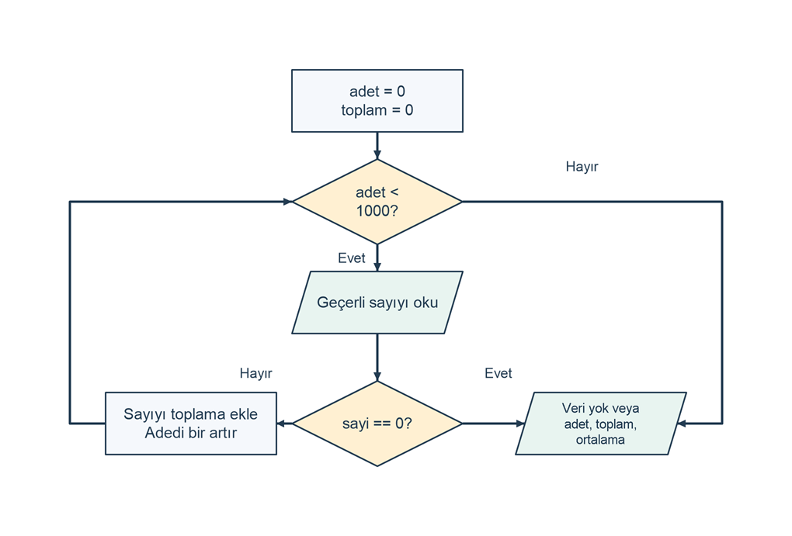

# Bitiş değeriyle sayıların toplamını ve ortalamasını bulma

## Problem tanımı

Kaç sayı girileceği önceden belli olmayan bir veri dizisinin toplamını ve aritmetik ortalamasını bulun. Her sayı -1000000 ile 1000000 arasında bir tamsayıdır. Kullanıcı 0 girdiğinde veri girişi biter. Bu problemde 0 yalnızca bitiş işaretidir; toplama ve sayaca eklenmez. Program ayrıca en fazla 1000 sıfır dışı sayı kabul eder. Bu sayıya ulaşınca başka girdi istemeden sonucu yazdırır.

Örneğin 12, -3, 6 ve 0 girildiğinde üç sayı işlenir, toplam 15 ve ortalama 5.00 olur. İlk girdi 0 ise veri yoktur; ortalama hesaplanmaz. Geçersiz bir giriş veya bitiş değerinden önce girişin sona ermesi halinde hata yazılır ve önceki sayıların kısmi sonucu verilmez. Böylece eksik bir giriş dizisi tamamlanmış veri gibi gösterilmez.

## Girdi ve çıktı

| Tür | Ad | Açıklama |
| --- | --- | --- |
| Girdi | `sayi` | -1000000 ile 1000000 arasında `int`; her satırda bir sayı. |
| Kontrol | 0 | Veri girişi için bitiş değeri; veri sayılmaz. |
| Çıktı | `adet` | Kabul edilen sıfır dışı sayı sayısı; `Adet: N`. |
| Çıktı | `toplam` | `long` türünde toplam; `Toplam: N`. |
| Çıktı | `ortalama` | `double` türünde ortalama; `Ortalama: F2`. |

Her okuma için `Sayı (-1000000..1000000, bitirmek için 0): ` istemi yazılır. En fazla 1000 sıfır dışı sayı okunur. Hiç veri girilmezse yalnızca `Sonuç: Veri girilmedi.` yazılır. Hatalı biçim, aralık dışı sayı, boş satır veya erken giriş sonu için `Hata: -1000000 ile 1000000 arasında bir tamsayı giriniz.` yazılır. Sonuçlarda ondalık ayırıcı nokta, ortalamada iki ondalık basamak kullanılır.

## Algoritma

1. `adet` değerini 0, `toplam` değerini 0 olarak başlatın.
2. `adet < 1000` olduğu sürece döngüye girin.
3. Bir sayı okuyun; biçimi veya aralığı geçersizse hata yazıp programı bitirin.
4. Sayı 0 ise `break` ile veri giriş döngüsünden çıkın.
5. Sıfır dışı sayıyı toplama ekleyin ve `adet` değerini bir artırın.
6. Döngü bitince `adet == 0` ise veri yok mesajı yazıp bitirin.
7. Toplamı `double` türüne çevirerek `adet` değerine bölün.
8. Adedi, toplamı ve ortalamayı yazdırın.

Döngü başında `adet`, o ana kadar kabul edilen sıfır dışı sayıların sayısını; `toplam`, aynı sayıların toplamını temsil eder. Yeni sayı eklendiğinde iki değişken birlikte güncellenir. Bu ilişki her yinelemede korunur. Bitiş değeri kontrolü güncellemeden önce yapıldığı için 0 hiçbir zaman veri sayılmaz. `while` koşulu ise 1001. sayının istenmesini önler.

Şema yalnızca geçerli girişlerin akışını gösterir. Her okumadan sonra kodda uygulanan biçim ve aralık doğrulaması, şemayı sade tutmak için gösterilmemiştir. Son çıktı adımı, adet sıfırsa veri yok mesajını; aksi halde üç sonuç satırını seçer.

```diagram
{
  "caption": "Bitiş değeri ve en fazla 1000 veri ile giriş döngüsü",
  "nodes": [
    {"id":"init", "text":"adet = 0\ntoplam = 0", "kind":"process", "x":1, "y":0},
    {"id":"limit", "text":"adet < 1000?", "kind":"decision", "x":1, "y":1},
    {"id":"read", "text":"Geçerli sayıyı oku", "kind":"io", "x":1, "y":2},
    {"id":"zero", "text":"sayi == 0?", "kind":"decision", "x":1, "y":3.2},
    {"id":"add", "text":"Sayıyı toplama ekle\nAdedi bir artır", "kind":"process", "x":0, "y":3.2},
    {"id":"write", "text":"Veri yok veya\nadet, toplam, ortalama", "kind":"io", "x":2.2, "y":3.2}
  ],
  "edges": [
    {"from":"init", "to":"limit"},
    {"from":"limit", "to":"read", "label":"Evet"},
    {"from":"limit", "to":"write", "label":"Hayır", "via":[[2.85,1],[2.85,3.2]], "label_at":[2.1,0.65]},
    {"from":"read", "to":"zero"},
    {"from":"zero", "to":"add", "label":"Hayır", "label_at":[0.35,2.7]},
    {"from":"zero", "to":"write", "label":"Evet", "label_at":[1.65,2.7]},
    {"from":"add", "to":"limit", "via":[[-0.65,3.2],[-0.65,1]]}
  ]
}
```



## C# çözümü

```csharp
using System;
using System.Globalization;

int adet = 0;
long toplam = 0;

while (adet < 1000)
{
    Console.Write("Sayı (-1000000..1000000, bitirmek için 0): ");
    if (!int.TryParse(Console.ReadLine(), NumberStyles.Integer,
        CultureInfo.InvariantCulture, out int sayi) ||
        sayi < -1000000 || sayi > 1000000)
    {
        Console.WriteLine("Hata: -1000000 ile 1000000 arasında bir tamsayı giriniz.");
        return;
    }

    if (sayi == 0)
    {
        break;
    }

    toplam += sayi;
    adet++;
}

if (adet == 0)
{
    Console.WriteLine("Sonuç: Veri girilmedi.");
    return;
}

double ortalama = (double)toplam / adet;
Console.WriteLine("Adet: " + adet.ToString(CultureInfo.InvariantCulture));
Console.WriteLine("Toplam: " + toplam.ToString(CultureInfo.InvariantCulture));
Console.WriteLine("Ortalama: " + ortalama.ToString("F2", CultureInfo.InvariantCulture));
```

Kod bağımsız bir konsol projesinin `Program.cs` dosyasında çalışır. `break` yalnızca döngüyü bitirir; ardından sonuç hesaplanır. `return` ise tüm programı bitirdiği için geçersiz girişte kısmi sonuç yazılmaz. `(double)toplam` dönüşümü tamsayı bölmesini önler. Örneğin toplam 1 ve adet 2 olduğunda ortalama 0.50 olur.

## Örnek çalıştırmalar

Girdi sütunundaki değerler ayrı satırlarda girilir. Sonuç sütunu giriş istemleri dışındaki tüm çıktı satırlarını gösterir. "1000 kez" ifadesi, ilgili değerin 1000 ayrı satırda verilmesini belirtir.

| Girdi | Sonuç | Açıklama |
| --- | --- | --- |
| `12`, `-3`, `6`, `0` | `Adet: 3`<br>`Toplam: 15`<br>`Ortalama: 5.00` | Bitiş değeri adede eklenmez. |
| `0` | `Sonuç: Veri girilmedi.` | İlk girişte boş veri. |
| `1`, `0` | `Adet: 1`<br>`Toplam: 1`<br>`Ortalama: 1.00` | Tek veri. |
| `1`, `-1`, `0` | `Adet: 2`<br>`Toplam: 0`<br>`Ortalama: 0.00` | Toplamın sıfır olması veri yok anlamına gelmez. |
| `2`, `-1`, `0` | `Adet: 2`<br>`Toplam: 1`<br>`Ortalama: 0.50` | Ondalıklı ortalama. |
| `-1000000`, `1000000`, `0` | `Adet: 2`<br>`Toplam: 0`<br>`Ortalama: 0.00` | İki geçerli uç değer. |
| 1000 kez `1000000` | `Adet: 1000`<br>`Toplam: 1000000000`<br>`Ortalama: 1000000.00` | Üst adet sınırında kendiliğinden biter. |
| 1000 kez `-1000000` | `Adet: 1000`<br>`Toplam: -1000000000`<br>`Ortalama: -1000000.00` | En küçük toplam. |
| `5`, `1000001` | `Hata: -1000000 ile 1000000 arasında bir tamsayı giriniz.` | Daha önceki 5 için sonuç verilmez. |
| İlk girdi `iki` | `Hata: -1000000 ile 1000000 arasında bir tamsayı giriniz.` | Metin reddedilir. |
| `5`, sonra girişin sonu | `Hata: -1000000 ile 1000000 arasında bir tamsayı giriniz.` | 0 gelmeden eksik kalan giriş reddedilir. |

## Sınır durumları

- İlk sayı 0 ise adet sıfır kalır; sıfıra bölme yapılmaz.
- Pozitif ve negatif sayıların toplamı sıfır olabilir; boş veri kontrolünde toplam yerine adet kullanılır.
- Bitiş değeri nedeniyle 0 bu çalışmada ölçüm değeri olarak girilemez. Sıfırın veri olması gereken bir tasarım başka bitiş yöntemi kullanmalıdır.
- 1000. sıfır dışı sayı eklendiğinde döngü koşulu yanlış olur. 1001. satır ve ayrıca bitiş değeri okunmaz.
- Toplam -1000000000 ile 1000000000 arasında kalır. Bu sınır `int` içine de sığsa da toplam için `long` kullanılması, biriktirme değişkeninin aralığını açıkça ayırır.
- Hatalı giriş, boş satır veya erken giriş sonu, sonuç hesaplamasından önce programı bitirir.

## Kazanımlar

- Tekrar sayısı önceden bilinmeyen girişleri `while` döngüsüyle işleme.
- Bitiş değerini gerçek veriden ayırıp güncellemeden önce denetleme.
- Sayaç ve toplamın her yinelemede aynı veri kümesini temsil etmesini sağlama.
- Boş veri için bölme öncesinde kontrol yapma.
- Döngüden çıkış ile programdan çıkışın sonuç üzerindeki farkını açıklama.

## Alıştırmalar

1. Toplam ve ortalamaya ek olarak pozitif ve negatif sayı adetlerini iki ayrı sayaçla yazdırın. Bitiş değerini hiçbir sayaca katmayın.
2. Giriş sınırını 1000'den 2000'e çıkarın. Toplamın olası alt ve üst sınırlarını hesaplayıp tür seçimini yeniden değerlendirin.
3. Geçersiz satırda programı bitirmek yerine aynı sıradaki veriyi yeniden isteyen bir sürüm yazın. Giriş sonu için döngünün nasıl biteceğini ayrıca belirleyin.
