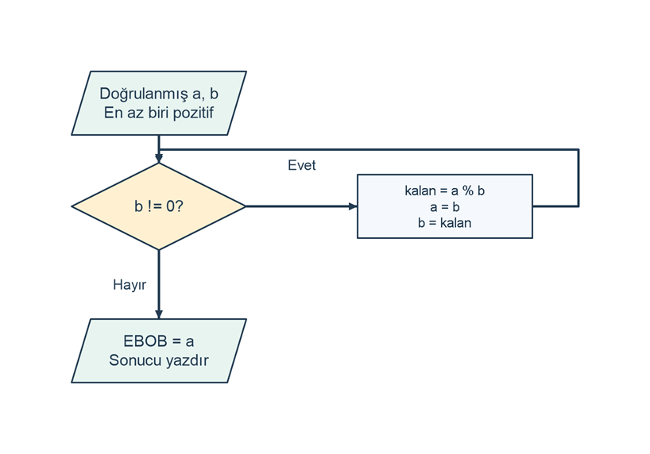

# Öklid algoritmasıyla EBOB hesaplama

## Problem tanımı

Sıfır veya pozitif iki tamsayının en büyük ortak bölenini (EBOB) hesaplayın. EBOB, iki sayıyı da kalansız bölen pozitif tamsayıların en büyüğüdür. Örneğin 48 ve 18'in ortak bölenleri 1, 2, 3 ve 6'dır; sonuç 6 olur.

Öklid algoritması, bütün bölenleri listelemek yerine `EBOB(a, b) = EBOB(b, a % b)` özelliğini kullanır. Kalan sıfır olduğunda son sıfır olmayan değer sonuçtur. Bir girdi sıfırsa diğer pozitif sayı EBOB olur. Her iki girdi sıfır olduğunda en büyük pozitif ortak bölen yoktur; bu çalışma bu durumu hata olarak ele alır.

## Girdi ve çıktı

| Tür | Ad | Açıklama |
| --- | --- | --- |
| Girdi | `a` | 0 ile 2147483647 arasında ilk `int`. |
| Girdi | `b` | 0 ile 2147483647 arasında ikinci `int`. |
| Çıktı | EBOB | `EBOB: değer` biçiminde pozitif tamsayı. |

`İlk sayı (0..2147483647): ` ve `İkinci sayı (0..2147483647): ` istemlerine sırayla tamsayı girin. Aralık veya biçim yanlışsa ilgili sayı için hata yazılır ve sonraki işlem yapılmaz. İki sıfır için `Hata: İki sayı aynı anda sıfır olamaz; EBOB tanımsızdır.` yazılır.

## Algoritma

1. İlk ve ikinci sayıyı okuyup ayrı ayrı doğrulayın.
2. Her iki sayı sıfırsa hata yazıp bitirin.
3. İkinci sayı `b` sıfır olmadığı sürece döngüyü sürdürün.
4. `a % b` değerini `kalan` geçici değişkenine alın.
5. `a` değişkenine eski `b` değerini, ardından `b` değişkenine kalanı atayın.
6. Döngü bittiğinde `a` değişkenini EBOB olarak yazdırın.

Bir ortak bölen `a` ve `b` sayılarını bölüyorsa `a - q * b` farkını da böler; bu fark uygun `q` için kalandır. Tersine, `b` ile kalanı bölen sayı `a = q * b + kalan` değerini de böler. Bu nedenle her güncellemede ortak bölenler ve EBOB korunur. `b > 0` iken `0 <= kalan < b` olur. Yeni ikinci sayı eskisinden küçüldüğü için sıfıra ulaşılır ve döngü biter. `%` işlemi yalnızca `b != 0` koşulu sağlandığında yapılır.

48 ve 18 için her satır bir döngü adımını gösterir.

| Adım | Adım başında a | Adım başında b | Kalan | Adım sonunda a / b |
| --- | --- | --- | --- | --- |
| 1 | 48 | 18 | 12 | 18 / 12 |
| 2 | 18 | 12 | 6 | 12 / 6 |
| 3 | 12 | 6 | 0 | 6 / 0 |

Şema, iki girdi doğrulandıktan ve ikisinin birden sıfır olmadığı belirlendikten sonraki hesaplamayı gösterir.

```diagram
{
  "caption": "Öklid algoritmasında kalan ile küçülen durum",
  "nodes": [
    {"id":"read", "text":"Doğrulanmış a, b\nEn az biri pozitif", "kind":"io", "x":1, "y":0},
    {"id":"check", "text":"b != 0?", "kind":"decision", "x":1, "y":1},
    {"id":"update", "text":"kalan = a % b\na = b\nb = kalan", "kind":"process", "x":2.5, "y":1},
    {"id":"write", "text":"EBOB = a\nSonucu yazdır", "kind":"io", "x":1, "y":2.4}
  ],
  "edges": [
    {"from":"read", "to":"check"},
    {"from":"check", "to":"update", "label":"Evet", "label_at":[1.75,0.6]},
    {"from":"update", "to":"check", "via":[[3.2,1],[3.2,0.45],[1,0.45]]},
    {"from":"check", "to":"write", "label":"Hayır"}
  ]
}
```



## C# çözümü

```csharp
using System;
using System.Globalization;

Console.Write("İlk sayı (0..2147483647): ");
if (!int.TryParse(Console.ReadLine(), NumberStyles.Integer,
    CultureInfo.InvariantCulture, out int a) || a < 0)
{
    Console.WriteLine("Hata: İlk sayı 0 ile 2147483647 arasında bir tamsayı olmalıdır.");
    return;
}

Console.Write("İkinci sayı (0..2147483647): ");
if (!int.TryParse(Console.ReadLine(), NumberStyles.Integer,
    CultureInfo.InvariantCulture, out int b) || b < 0)
{
    Console.WriteLine("Hata: İkinci sayı 0 ile 2147483647 arasında bir tamsayı olmalıdır.");
    return;
}

if (a == 0 && b == 0)
{
    Console.WriteLine("Hata: İki sayı aynı anda sıfır olamaz; EBOB tanımsızdır.");
    return;
}

while (b != 0)
{
    int kalan = a % b;
    a = b;
    b = kalan;
}

Console.WriteLine("EBOB: " + a.ToString(CultureInfo.InvariantCulture));
```

Girdiler hesaplama sırasında değiştirilir. `kalan`, iki atamadan önce eski çiftin kalanını saklar. Önce `a = b` yapıp sonra `a % b` hesaplamak eski ilk sayıyı kaybettirir ve yanlış bir sıfır kalanı üretir. Başlangıçta `a < b` olabilir; ilk adım çiftin sırasını değiştirerek algoritmayı devam ettirir.

## Örnek çalıştırmalar

Girdiler ilk ve ikinci sayı sırasındadır. Sonuç sütunu istemlerden sonraki tam sonuç veya hata satırını gösterir.

| Girdi | Sonuç | Açıklama |
| --- | --- | --- |
| `48`, `18` | `EBOB: 6` | Üç kalan adımı. |
| `18`, `48` | `EBOB: 6` | Girdi sırası sonucu değiştirmez. |
| `17`, `13` | `EBOB: 1` | Sayılar aralarında asaldır. |
| `24`, `24` | `EBOB: 24` | İlk kalan sıfırdır. |
| `0`, `12` | `EBOB: 12` | İlk sayı sıfırdır. |
| `12`, `0` | `EBOB: 12` | Döngü çalışmadan sonuç yazılır. |
| `2147483647`, `0` | `EBOB: 2147483647` | En büyük girdi ve sıfır. |
| `2147483647`, `2147483646` | `EBOB: 1` | Ardışık tamsayılar aralarında asaldır. |
| `0`, `0` | `Hata: İki sayı aynı anda sıfır olamaz; EBOB tanımsızdır.` | Özel geçersiz çift. |
| İlk girdi `-1` | `Hata: İlk sayı 0 ile 2147483647 arasında bir tamsayı olmalıdır.` | İkinci sayı istenmez. |
| `12`, `sayı` | `Hata: İkinci sayı 0 ile 2147483647 arasında bir tamsayı olmalıdır.` | İkinci alan metindir. |

## Sınır durumları

- Bir sayı sıfırsa diğer sayı pozitif olmalıdır; EBOB pozitif olan sayıdır.
- Her iki sıfır için hesaplama başlamadan hata verilir.
- Girdilerin büyükten küçüğe sıralanması gerekmez.
- `b = 0` olduğunda `%` gövdesi çalışmaz; sıfıra bölme oluşmaz.
- Kalan önceki ikinci sayıdan küçük veya sıfırdır. Çarpma yapılmadığından büyük girdilerde ek bir taşma riski oluşmaz.
- Boş giriş, kesirli sayı, negatif sayı ve `int` sınırı dışındaki değerler ilgili alanın hata mesajıyla reddedilir.

## Kazanımlar

- EBOB tanımını tek sıfır ve iki sıfır durumlarını ayırarak uygulama.
- Öklid eşitliğinin ortak bölenleri neden koruduğunu bölme-kalan ilişkisiyle açıklama.
- 48 ve 18 için tüm durum çiftlerini sırasıyla yazma.
- Geçici değişkenle eski iki değeri kullanarak güvenli durum güncellemesi yapma.
- Azalan ikinci değişkeni kullanarak `while` döngüsünün sonlanmasını açıklama.

## Alıştırmalar

1. Her döngü adımında `a`, `b` ve `kalan` değerlerini yazdırın; 18 ve 48 girdisindeki ilk adımı yorumlayın.
2. Döngüye eklenen bir sayaçla kalan hesaplama sayısını çıktı olarak verin; 12 ve 0 için sayacın sıfır kaldığını doğrulayın.
3. Üç sayının EBOB'unu iki aşamada hesaplayın. İlk iki sayı aynı anda sıfırsa ara EBOB hesabına girmeyin; üçüncü sayı pozitifse sonuç doğrudan bu sayıdır. Diğer durumlarda önce ilk ikinin EBOB'unu, sonra bu sonuçla üçüncü sayının EBOB'unu bulun. Üç sıfır için hata verin; `(0, 0, 12)` örneğinin sonucunu ayrıca doğrulayın.
