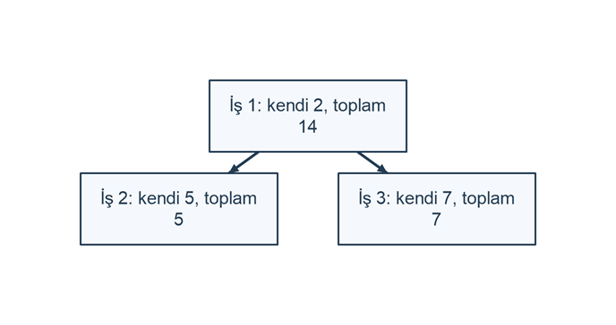

# İş ağacında birikimli süre raporu

## Problem tanımı

Bir proje iş ağacındaki alt işlerin sürelerini üst işlere taşıyan rapor yazın. İş tanımlarıyla süre kayıtları ayrı dosyalardadır. Her işin kendi süresini ve bütün alt işleri dahil birikimli süresini hesaplayın. Eksik üst iş veya döngü varsa rapor üretmeyin. Tanımların üst işten önce gelmesi gerekmez; dosya sırası ilişki sırası değildir.

## Girdi ve çıktı

Üç yol: `ornek-090/isler.txt ornek-090/sureler.txt ornek-090/rapor.txt`. İş satırı `kod;üstKod`: benzersiz kod 1..9999; üstKod 0 kök, aksi halde mevcut iş kodudur. Birden çok kök kabul edilir. Süre satırı `kod;dakika`: mevcut iş kodu ve 1..1000 tamsayı dakika; tekrarlanan süre kodları kendi süreye eklenir. Dosya başına ortak 100 satır sınırı vardır. Çıktı artan kod sırasıyla `kod;kendiDakika;birikimliDakika` biçiminde başlıksızdır. Konsola yalnız `Rapor yazıldı.` yazılır.

Yollar komut satırı argümanlarıdır; program istem yazmaz. Kod bağımsız .NET 10 konsol projesinin Program.cs dosyasında çalışır. Örnekleri yalnız kendinizin oluşturduğu ayrı bir örnek klasöründe hazırlayın; program giriş dosyalarını değiştirmez. Proje klasöründen `dotnet run --` sonrasında belirtilen yolları verin. Göreli yollar programın çalışma klasörüne göredir.

Her giriş dosyası isteğe bağlı UTF-8 BOM ile UTF-8 metindir. LF ve CRLF kabul edilir. Dosya başına en fazla 32768 bayt, 100 fiziksel satır ve satır başına 120 UTF-16 kod birimi kabul edilir. Sınırlar dosya açıldıktan sonra ve her satır saklanmadan önce denetlenir. Bu küçük sınırlar öğretim amaçlıdır; büyük dosya akışı ayrı bir tasarım gerektirir. ReadLine satır sonunu çıkarır: null EOF, boş metin ise gerçek boş satırdır. Sondaki tek satır sonu ek bir boş kayıt oluşturmaz; art arda iki satır sonu aradaki boş satırı oluşturur.

İlk hata işlemi durdurur; doğrulama bitmeden sonuç yazılmaz. Biçim hatasında dosyanın adı ve 1 tabanlı fiziksel satır numarası bildirilir. Eksik dosya, klasörün bulunamaması veya diğer I/O sorunlarında `Hata: Dosya işlemi başarısız.`; yetki sorununun ayrı yakalanması halinde `Hata: Dosyaya erişim izni yok.` yazılır. Geçersiz yol veya bozuk UTF-8 için `Hata: Yol veya UTF-8 kodlaması geçersiz.` yazılır. `using` blokları hata halinde de akışı ve okuyucuyu kapatır.

Sayısal alanlarda çevre boşluğu, binlik ayırıcı, üs gösterimi ve virgüllü ondalık kabul edilmez. Tamsayıda isteğe bağlı + veya - işareti ve ASCII rakamlar kullanılır; baştaki sıfırlar kabul edilir. Ondalıkta isteğe bağlı işaret, en az bir tam kısım rakamı ve varsa noktadan sonra 1..2 rakam vardır. Girdi ve çıktı CultureInfo.InvariantCulture kullanır. Taşan sayı ayrıştırma hatasıdır.

Çıktı yolu üçüncü argümandır; dosya henüz var olmamalıdır ve üst klasörünü siz önceden oluşturmalısınız. FileMode.CreateNew mevcut bir dosyayı girişle aynı yol olsa bile ezmez; bu durumda I/O hatası oluşur. Başarı mesajı yalnız yazıcı ve akış kapandıktan sonra verilir. Giriş doğrulama hatasında çıktı dosyası hiç açılmaz. Yazım sırasında disk dolması gibi I/O hatasında yeni dosya kısmi kalabilir; program başarı bildirmez ve bu yeni dosyayı siz denetleyip başka adla tekrar deneyebilirsiniz. Bu küçük öğretim örneği atomik yayın sözü vermez. Çıktı UTF-8 BOM olmadan, LF satır sonlarıyla yazılır; her kayıt son LF ile biter. Bu örnekte kayıtsız rapor sıfır bayttır.

## Algoritma

1. İş tanımlarını okuyun; benzersiz kodları ve üst kod aralıklarını doğrulayın.
2. Bütün tanımlar okunduktan sonra üst kodları dizi dizinlerine dönüştürün; bulunmayanı tanım satırında bildirin.
3. Her işin üst zincirini üç durumla gezin: 0 görülmedi, 1 bu çağrı zincirinde, 2 tamamlandı. Durum 1 ziyaretinde döngü vardır.
4. Süre dosyasını doğrulayın; kod başına kendi dakika toplamını biriktirin.
5. Bir işin toplamı kendi süresi ile çocuklarının özyinelemeli toplamıdır; tamamlanan toplamları ayrı bool dizisiyle önbelleğe alın.
6. Kodları değiştirmeden dizin dizisini eklemeli sıralayın, raporu oluşturun ve yeni dosyaya yazın.

| İş | Üst iş | Kendi dakika | Alt iş toplamları | Birikimli dakika |
| --- | --- | --- | --- | --- |
| 3 | 1 | 7 | yok | 7 |
| 2 | 1 | 5 | yok | 5 |
| 1 | kök | 2 | 7 + 5 | 14 |

```diagram
{
  "caption": "Üst iş ve alt işlerin süreleri",
  "nodes": [
    {"id":"root","text":"İş 1: kendi 2, toplam 14","kind":"process","x":0,"y":0},
    {"id":"left","text":"İş 2: kendi 5, toplam 5","kind":"process","x":-0.6,"y":0.8},
    {"id":"right","text":"İş 3: kendi 7, toplam 7","kind":"process","x":0.6,"y":0.8}
  ],
  "edges": [
    {"from":"root","to":"left"},
    {"from":"root","to":"right"}
  ]
}
```



`Oku`, `out n` ile satır adedini verir; dizilerin yalnız ilk n hücresi veridir.

## C# çözümü

```csharp
using System;
using System.IO;
using System.Text;
using System.Globalization;

try
{
    if (args.Length != 3) throw new FormatException("İki giriş ve bir çıktı yolu gerekli.");
    string[] s = Oku(args[0], out int n);
    int[] kod = new int[100], ustKod = new int[100], ust = new int[100];
    for (int i = 0; i < n; i++)
    {
        string[] a = Alanlar(args[0], i + 1, s[i], 2);
        kod[i] = Tam(args[0], i + 1, a[0], 1, 9999);
        ustKod[i] = Tam(args[0], i + 1, a[1], 0, 9999);
        if (Bul(kod, i, kod[i]) >= 0) Hata(args[0], i + 1, "Yinelenen kod.");
    }
    for (int i = 0; i < n; i++)
    {
        ust[i] = ustKod[i] == 0 ? -1 : Bul(kod, n, ustKod[i]);
        if (ustKod[i] != 0 && ust[i] < 0)
            Hata(args[0], i + 1, "Üst iş bulunamadı.");
    }
    int[] durum = new int[100];
    for (int i = 0; i < n; i++) Denetle(i, ust, durum, args[0]);
    int[] kendi = new int[100];
    string[] t = Oku(args[1], out int tn);
    for (int i = 0; i < tn; i++)
    {
        string[] a = Alanlar(args[1], i + 1, t[i], 2);
        int kimlik = Tam(args[1], i + 1, a[0], 1, 9999);
        int dakika = Tam(args[1], i + 1, a[1], 1, 1000);
        int p = Bul(kod, n, kimlik);
        if (p < 0) Hata(args[1], i + 1, "İş bulunamadı.");
        kendi[p] += dakika;
    }
    int[] toplam = new int[100], sira = new int[100];
    bool[] hazir = new bool[100];
    for (int i = 0; i < n; i++)
    {
        Topla(i, ust, kendi, toplam, hazir, n);
        sira[i] = i;
    }
    Sirala(sira, kod, n);
    var rapor = new StringBuilder();
    for (int i = 0; i < n; i++)
    {
        int p = sira[i];
        rapor.Append(kod[p].ToString(CultureInfo.InvariantCulture) + ";" +
            kendi[p].ToString(CultureInfo.InvariantCulture) + ";" +
            toplam[p].ToString(CultureInfo.InvariantCulture) + "\n");
    }
    Yaz(args[2], rapor.ToString());
    Console.WriteLine("Rapor yazıldı.");
}
catch (FormatException e) { Console.WriteLine("Hata: " + e.Message); }
catch (IOException) { Console.WriteLine("Hata: Dosya işlemi başarısız."); }
catch (UnauthorizedAccessException)
{ Console.WriteLine("Hata: Dosyaya erişim izni yok."); }
catch (ArgumentException)
{ Console.WriteLine("Hata: Yol veya UTF-8 kodlaması geçersiz."); }
catch (NotSupportedException)
{ Console.WriteLine("Hata: Yol biçimi desteklenmiyor."); }

static string[] Oku(string yol, out int n)
{
    string[] satirlar = new string[100];
    n = 0;
    using var akis = new FileStream(yol, FileMode.Open,
        FileAccess.Read, FileShare.Read);
    if (akis.Length > 32768) throw new FormatException(
        Path.GetFileName(yol) + ": Dosya 32768 baytı aşıyor.");
    using var okuyucu = new StreamReader(akis,
        new UTF8Encoding(false, true), false);
    string? satir;
    while ((satir = okuyucu.ReadLine()) is not null)
    {
        if (n == 0 && satir.StartsWith('\uFEFF'))
            satir = satir.Substring(1);
        if (n == 100) Hata(yol, n + 1, "En fazla 100 satır.");
        if (satir.Length > 120) Hata(yol, n + 1,
            "Satır en fazla 120 karakter.");
        satirlar[n++] = satir;
    }
    return satirlar;
}

static void Hata(string yol, int satir, string mesaj)
{
    throw new FormatException(Path.GetFileName(yol) +
        ": satır " + satir.ToString(CultureInfo.InvariantCulture) +
        ": " + mesaj);
}


static string[] Alanlar(string yol, int satir, string metin,
    int adet)
{
    string[] alan = metin.Split(';');
    if (alan.Length != adet)
        Hata(yol, satir, "Alan sayısı yanlış.");
    return alan;
}

static int Tam(string yol, int satir, string metin,
    int alt, int ust)
{
    if (!int.TryParse(metin, NumberStyles.AllowLeadingSign,
        CultureInfo.InvariantCulture, out int deger) ||
        deger < alt || deger > ust)
        Hata(yol, satir, "Geçersiz tamsayı.");
    return deger;
}


static int Bul(int[] kodlar, int n, int kod)
{
    for (int i = 0; i < n; i++)
        if (kodlar[i] == kod) return i;
    return -1;
}


static void Yaz(string yol, string metin)
{
    using var akis = new FileStream(yol, FileMode.CreateNew,
        FileAccess.Write, FileShare.None);
    using var yazici = new StreamWriter(akis, new UTF8Encoding(false));
    yazici.NewLine = "\n";
    yazici.Write(metin);
}


static void Denetle(int i, int[] ust, int[] durum, string yol)
{
    if (durum[i] == 2) return;
    if (durum[i] == 1) Hata(yol, i + 1, "Üst iş döngüsü.");
    durum[i] = 1;
    if (ust[i] >= 0) Denetle(ust[i], ust, durum, yol);
    durum[i] = 2;
}

static int Topla(int i, int[] ust, int[] kendi, int[] toplam,
    bool[] hazir, int n)
{
    if (hazir[i]) return toplam[i];
    int sonuc = kendi[i];
    for (int j = 0; j < n; j++)
        if (ust[j] == i) sonuc += Topla(j, ust, kendi, toplam, hazir, n);
    toplam[i] = sonuc; hazir[i] = true;
    return sonuc;
}

static void Sirala(int[] sira, int[] kod, int n)
{
    for (int i = 1; i < n; i++)
    {
        int p = sira[i], j = i - 1;
        while (j >= 0 && kod[sira[j]] > kod[p])
        { sira[j + 1] = sira[j]; j--; }
        sira[j + 1] = p;
    }
}
```

## Örnek çalıştırmalar

`dotnet run -- ornek-090/isler.txt ornek-090/sureler.txt ornek-090/rapor.txt`; isler.txt:

```text
3;1
1;0
2;1
```

sureler.txt:
```text
1;2
2;5
3;4
3;3
```

Yeni rapor.txt dosyasının tam içeriği:
```text
1;2;14
2;5;5
3;7;7
```

Konsolun tam çıktısı:

```text
Rapor yazıldı.
```

Her iki giriş boş ve rapor.txt yoksa yeni rapor.txt sıfır bayttır. Konsolun tam çıktısı:

```text
Rapor yazıldı.
```

sureler.txt boş; isler.txt döngü:

```text
1;2
2;1
```

rapor.txt oluşturulmaz. Konsolun tam çıktısı:

```text
Hata: isler.txt: satır 1: Üst iş döngüsü.
```

sureler.txt boş; isler.txt eksik üst:

```text
1;9
```

rapor.txt oluşturulmaz. Konsolun tam çıktısı:

```text
Hata: isler.txt: satır 1: Üst iş bulunamadı.
```

## Sınır durumları

- Kendi üstü olan iş de döngüdür. Döngü hatası, dosya sırasıyla yapılan üst zinciri ziyaretinde ilk yeniden girilen işin tanım satırını verir; bu sayı zincirin son satırı olmayabilir.
- İş tanım kodları benzersizdir; süre kayıtlarında tekrar normaldir. Boş süre dosyasında bütün iş süreleri 0; boş iş dosyasında süre kaydı varsa hata olur.
- Döngü denetimi süre okumadan önce yapılır. Önce iş kaynağı hatası raporlanır.
- En fazla 100 iş nedeniyle çağrı derinliği en fazla 100; her işin alt ağacı dosyanın toplam 100000 dakikasını aşmaz. Toplamlar int aralığına sığar. Farklı üst işlerin rapor toplamlarını yeniden toplamak süreleri birden fazla sayar.
- Çocuk araması n elemanlık taramadır; önbellek her işi bir kez tamamlar. Denetim ve toplam hesabı bu temsil ile en kötü n² iş yapar. Sıralanan dizinlerdir; üst ilişkilerinin dizinleri değişmez.

## Kazanımlar

- Dosya sırası ile veri ilişkilerinin sırasını ayırt etme.
- Döngü denetimini özyinelemeli toplamın önkoşulu olarak kurma.
- Hiyerarşi ve ayrı süre kümesini birleştirip kaynak konumlarını koruma.
- Dizin dizisini sıralayarak ilişkilerin bozulmasını önleme.

## Alıştırmalar

1. Her iş için alt iş sayısını ikinci bir özyinelemeli sonuç olarak hesaplayın.
2. 100 iş sınırını kaldırırken çağrı yığını ve çocuk arama maliyetinin nasıl değişeceğini tartışın.
